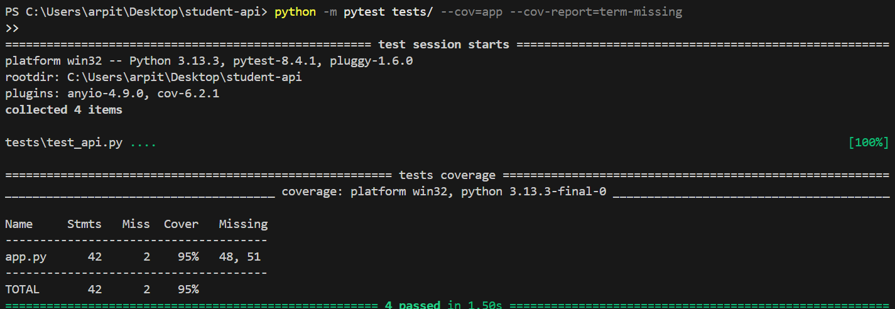

# 🧠 Student Manager API (Flask + MySQL)

This project was developed as part of the **Keploy API Fellowship**. It is a full-stack API project built with **Flask** and **MySQL**, including a frontend interface and robust testing using **Pytest** with mocked database connections.

> ✅ Contributed a verified, free-to-use public API with clear documentation and proper formatting to the Public APIs Collection repository.

## ✅ Features

* 📡 RESTful API using Python Flask
* 🗃️ MySQL database integration
* 🧾 Full CRUD operations on student records
* 🌐 HTML + JavaScript frontend for user interaction
* 🧪 Unit & API tests using `pytest`
* 🧰 Mocked database for safe and fast test coverage

## ⚙️ Technologies Used

* Python + Flask
* MySQL
* HTML + JavaScript (Frontend)
* Pytest + pytest-cov (Testing & Coverage)
* Flask-CORS, Flask-MySQLdb

## 📁 Folder Structure

student-api/
├── app.py
├── db\_config.py
├── templates/
│   └── index.html
├── static/
│   └── script.js
├── tests/
│   └── test\_api.py
├── requirements.txt
├── README.md
├── api\_test.png

## 🗄️ MySQL Setup

```sql
CREATE DATABASE studentdb;

USE studentdb;

CREATE TABLE students (
  id INT AUTO_INCREMENT PRIMARY KEY,
  name VARCHAR(100),
  email VARCHAR(100),
  course VARCHAR(100)
);
```

## 🚀 How to Run the Project

### 🛠️ Prerequisites

* Python 3
* MySQL server installed and running

### 📦 Install Python Dependencies

```bash
pip install flask flask-mysqldb flask-cors pytest pytest-cov
```

### ▶️ Run the Flask App

```bash
python app.py
```

Server will start at: [http://localhost:5000](http://localhost:5000)

## 🔗 API Endpoints

| Method | Endpoint             | Description          |
| ------ | -------------------- | -------------------- |
| GET    | `/api/students`      | Fetch all students   |
| POST   | `/api/students`      | Add a new student    |
| PUT    | `/api/students/<id>` | Update student by ID |
| DELETE | `/api/students/<id>` | Delete student by ID |

## 🌐 Frontend Interface

Visit the UI at: [http://localhost:5000/](http://localhost:5000/)

Includes:
✅ Form inputs to add a student
📋 Dynamic list displaying all students
❌ Delete buttons for each student

## 🧪 Running Tests

### ✅ Execute Unit + API Tests (Mocked DB)

```bash
python -m pytest tests/ --cov=app --cov-report=term-missing
```

### ✅ What’s Covered

* API response structure
* Request and error handling
* CRUD operations (mocked database layer)

📸 

## 📌 Notes

* The API works fully with a live MySQL database (`studentdb`) when running the Flask app.
* Testing uses mocked MySQL connections to ensure safety and speed.
* Ideal for deployment on platforms like Render, Railway, or Heroku.
* Designed as a clean starting point for any Flask + MySQL full-stack API app.

## 🤝 Contributing

Feel free to fork this repo, suggest improvements, or raise issues. Contributions are welcome!

## 📄 License

Licensed under the MIT License.
